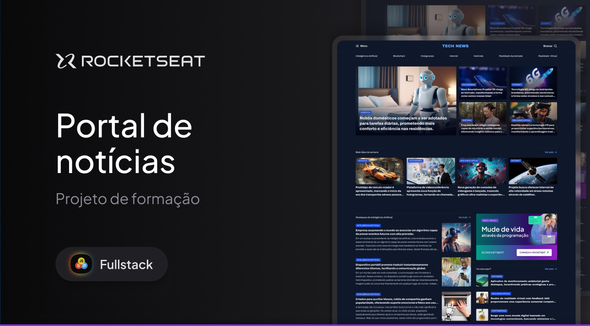

# Portal de Notícias — Tech News

Página de estudo desenvolvida durante o curso Fullstack da Rocketseat para praticar a estruturação de páginas com HTML e a criação de layouts com CSS.

O projeto apresenta um portal de notícias sobre tecnologia, com notícias em destaque, as mais lidas da semana, conteúdos sobre inteligência artificial e uma seção lateral com anúncio e outras matérias. Os conteúdos são ilustrativos, utilizados para compor o layout.

## Apresentação



## Tecnologias utilizadas

- HTML5
- CSS3
- Google Fonts — fonte Archivo

## Conceitos praticados

- Estruturação semântica com HTML.
- Organização do layout com CSS Grid e Flexbox.
- Uso de variáveis CSS para cores e tipografia.
- Classes utilitárias para espaçamento, tipografia e grids.
- Estilização de cards com imagens, legendas e gradientes.
- Separação dos estilos em arquivos por responsabilidade.

## Como acessar pelo GitHub Pages

Para visualizar o projeto diretamente no navegador, sem baixar o código ou instalar ferramentas:

1. Acesse [Portal de Notícias — Tech News](https://eduardonobilioni.github.io/Portal-de-noticias/).
2. Navegue pela página para conferir o layout e as seções de notícias.

## Estrutura do projeto

```text
├── index.html
├── README.md
├── assets/
│   ├── icons/
│   ├── images/
│   ├── projetoportalnoticias.png
│   └── Tech News.svg
└── styles/
    ├── index.css
    ├── global.css
    ├── header.css
    ├── sections.css
    └── utility.css
```

## Créditos

Projeto de estudo do curso Fullstack da Rocketseat, desenvolvido para fins educacionais e prática de desenvolvimento web.
